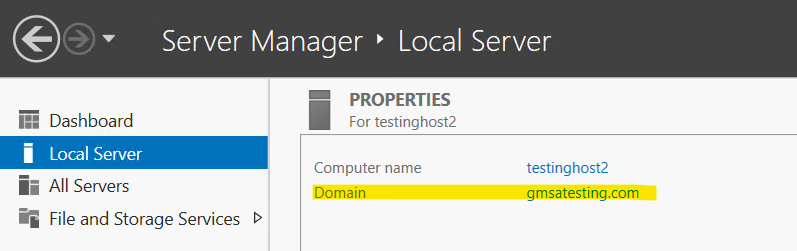
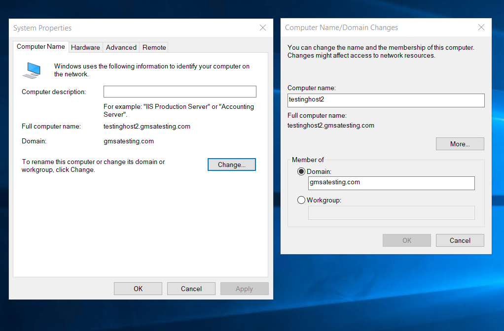
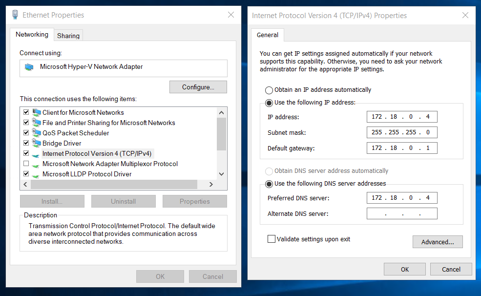

# Setting up gMSA v2 on AKS using Windows Server 2019 

## Create a domain controller
1. Create a resource, search "Resource Group" and create. This group will house all resources for this tutorial. 
2. Create a VM, make sure to select the resource group you just created. For the image, select Windows Server 2019 Datacenter. 
3. RDP into the VM you just created. 
4. Open the Server Manager and choose "Add roles and features" 
5. On "Server Roles", select "Active Directory Domain Services" and add the feature. 
6. On "Confirmation", select "Restart the destination server automatically if required", and then click install.  
7. Once the installation is complete, select "promote this server to a domain controller" 
8. In the "Deployment Configuration", select "Add a new forest" and enter your new domain name. 
9. In the next step "Domain Controller Options", create the directory services restore mode password. 
10. Nothing else needs to be configured, skip to the Installation step. 

## Create container host
Using Azure Portal, create a virtual machine. For the image, select Windows Server 2019 Datacenter and ensure you are selecting the same resource group you created your domain controller in. 

## Create gMSAs for Windows Containers 

*The following steps are taken from: [this documentation](
https://docs.microsoft.com/en-us/virtualization/windowscontainers/manage-containers/manage-serviceaccounts)*

### Prepare Active Directory (AD)
On your domain controller, run the following PowerShell cmdlet to check if the KDS root key has already been created.  
```
Get-KdsRootKey
``` 

If it has not, run `Add-KdsRootKey -EffectiveTime (Get-Date).AddHours(-10)` 

### Creating gMSA account for domain joined container hosts 
```
New-ADGroup -Name "WebApp01 Authorized Hosts" -SamAccountName "WebApp01Hosts" -GroupScope DomainLocal
```
```
New-ADServiceAccount -Name "WebApp01" -DnsHostName "WebApp01.gmsatesting.com" -ServicePrincipalNames "host/WebApp01", "host/WebApp01.gmsatesting.com" -PrincipalsAllowedToRetrieveManagedPassword "WebApp01Hosts"
```
```
Add-ADGroupMember -Identity "WebApp01Hosts" -Members "testinghost2$"
```

### Preparing the container host for a domain-joined container host 

### 1. Domain join your computer to AD domain 

To domain-join the computer, from the server manager, select "Local Server". Select "Domain".



This will open up system properties. From here, click "Change" and enter your domain controller information. 



If your container host VM cannot find the domain: 
1. Open Network & Internet settings, select "Change adapter options".
2. Right click on your network, and open "Properties"
3. Select "Internet Protocol Version 4(TCP/IPv4)" and select "Properties"
4. On your domain controller use `ipconfig` to grab your IP address 
5. Select "Use the following IP address" and enter your domain controller IP address, subnet mask, and default gateway. Additionally, enter the IP address in "Preferred DNS server". 
6. You might need to restart your VM for changes to take effect. 



### 2. [Set up Docker for Windows Server](https://docs.microsoft.com/en-us/virtualization/windowscontainers/quick-start/set-up-environment?tabs=Windows-Server)

Use the following Powershell commands to install Docker:  

```
Install-Module -Name DockerMsftProvider -Repository PSGallery -Force
```
```
Install-Package -Name docker -ProviderName DockerMsftProvider
```
```
Restart-Computer -Force
```

Check the installation using: 
```
Get-Package -Name Docker -ProviderName DockerMsftProvider
```

Start Docker: 
```
Start-Service Docker
````

### 3. Verify container host can use gMSA account 

```
Test-ADServiceAccount WebApp01
```

Your computer may need a restart for this cmdlet to return True. 

### Create a credential spec 
A credential spec file is a JSON document that contains metadata about the gMSA account(s) you want a container to use

```
Install-WindowsFeature RSAT-AD-PowerShell
```
```
Install-Module CredentialSpec
``` 
```
New-CredentialSpec -AccountName WebApp01
```

The file will be saved in the Docker CredentialSpecs directory using the gMSA domain and account name for the filename (e.g 
C:\ProgramData\docker\CredentialSpecs\gmsatesting_webapp01.json)


## Run a container with gMSA 
The following steps were taken from [this documentation](https://docs.microsoft.com/en-us/virtualization/windowscontainers/manage-containers/gmsa-run-container)

```
docker run --security-opt "credentialspec=file://gmsatesting_webapp01.json" --hostname webapp01 -it mcr.microsoft.com/windows/servercore:1809 powershell
```

If you run into this error: 
```
docker: Error response from daemon: container ba49bcd281dfe51b65ea580d9d2bc599759baf64a2acb844a69807e2f83428e6 encountered an error during hcsshim::System::CreateProcess: failure in a Windows system call: The system cannot find the file specified. (0x2).
```

Try to downgrade the dockerEE version: 

```
Install-Package -Name docker -ProviderName DockerMsftProvider -Force -RequiredVersion 19.03.5
```

Inside the container: 

`nltest /sc_verify:gmsatesting.com`

This should return an output similar to: 
```
Flags: b0 HAS_IP  HAS_TIMESERV
Trusted DC Name \\domain-controll.gmsatesting.com
Trusted DC Connection Status Status = 0 0x0 NERR_Success
Trust Verification Status = 0 0x0 NERR_Success
The command completed successfully
```

`klist get webapp01`

This should return an output similar to: 
```
Current LogonId is 0:0x4fddc8
A ticket to webapp01 has been retrieved successfully.

Cached Tickets: (2)

#0>     Client: WebApp01$ @ GMSATESTING.COM
        Server: krbtgt/GMSATESTING.COM @ GMSATESTING.COM
        KerbTicket Encryption Type: AES-256-CTS-HMAC-SHA1-96
        Ticket Flags 0x40e10000 -> forwardable renewable initial pre_authent name_canonicalize
        Start Time: 12/27/2021 3:40:05 (local)
        End Time:   12/27/2021 13:40:05 (local)
        Renew Time: 1/3/2022 3:40:05 (local)
        Session Key Type: AES-256-CTS-HMAC-SHA1-96
        Cache Flags: 0x1 -> PRIMARY
        Kdc Called: domain-controll.gmsatesting.com

#1>     Client: WebApp01$ @ GMSATESTING.COM
        Server: webapp01 @ GMSATESTING.COM
        KerbTicket Encryption Type: AES-256-CTS-HMAC-SHA1-96
        Ticket Flags 0x40a10000 -> forwardable renewable pre_authent name_canonicalize
        Start Time: 12/27/2021 3:40:05 (local)
        End Time:   12/27/2021 13:40:05 (local)
        Renew Time: 1/3/2022 3:40:05 (local)
        Session Key Type: AES-256-CTS-HMAC-SHA1-96
        Cache Flags: 0
        Kdc Called: domain-controll.gmsatesting.com
```

## Configure gMSA on Azure Kubernetes Service 
*The following steps were taken from [this documentation](https://docs.microsoft.com/en-us/virtualization/windowscontainers/manage-containers/gmsa-aks-ps-module)*

On your host, in an elevated PowerShell: 

```
Install-Module -Name AksGMSA -Repository PSGallery -Force
```

```
Connect-AzAccount -DeviceCode -Subscription "<SUBSCRIPTION_ID>"
```
```
$params = Get-AksGMSAParameters
```
Example inputs: 
```
The name given to the AKS cluster.
AKS cluster name: myAKScluster
The Azure resource group where the AKS cluster is deployed.
AKS cluster resource group name: judyAKScluster
The AKS node pools' names with the Kubernetes Windows agents. These pools are going to be authorized to fetch the configured gMSA.
Comma-separated list with the AKS Windows node pools' names: npwcd, npwin
Active Directory domain DNS server. This is going to be set as the main DNS server for the AKS Windows hosts. The AD DNS server should be able to forward requests, if they are not within the domain, otherwise the Windows hosts' upstream DNS will be broken.
AKS gMSA domain DNS server: 172.18.0.4
The Active Directory root domain name.
AKS gMSA root domain name: domain-controll
The Active Directory NetBIOS name.
AD NetBIOS name: GMSATESTING
The Active Directory group Managed Service Account (gMSA) name.
gMSA name: webapp01
The name of the domain user authorized to fetch the gMSA.
gMSA domain user name: demouser
The password of the domain user authorized to fetch the gMSA.
gMSA domain user password: ********************
gMSA domain user password (again): ********************
The Azure location used for the new resources (Azure key vault and Azure user-assigned managed identity).
Azure location: westeurope
Validating Azure location
The name of the Azure key vault where the gMSA domain user credential will be stored.
AKV name: gmsa-keyvault
The name of the AKV secret that will contain the gMSA domain user credential.
AKV secret name: gmsa-secret
The name of the Azure MI (managed identity) that will be used to fetch the AKV gMSA secret.
Azure MI name: gmsa-judy-managed-identity
The name given to the Kubernetes gMSA credential spec resource.
The gMSA spec name: gmsa-aks-credspec
The local directory path where the AKS Windows hosts' logs will be stored. If the directory doesn't exist, it will be created when the logs are collected.
Defaults to 'C:\gmsa-logs' if empty value is given.
Local logs directory:
The address of the AD domain controller. This is going to be used for remote commands execution, when creating the gMSA and the domain user. This is not needed, if the AD domain controller doesn't allow remote commands execution. More details in the docs.
AD domain controller address: 172.18.0.4
The domain admin user name. This is going to be used when creating the gMSA and the gMSA domain user. Give empty value if you don't have domain admin credential. More details in the docs.
Domain admin user name: demouser
The domain admin user password. This is going to be used when creating the gMSA and the gMSA domain user. Give empty value if you don't have domain admin credential. More details in the docs.
Domain admin user password: ********************
Domain admin user password (again): ********************
```

```
 Import-AzAksCredential -Force `
 -ResourceGroupName $params["aks-cluster-rg-name"] `
 -Name $params["aks-cluster-name"]
```

```
Confirm-AksGMSAConfiguration `
 -AksResourceGroupName $params["aks-cluster-rg-name"] `
 -AksClusterName $params["aks-cluster-name"] `
 -AksGMSADomainDnsServer $params["aks-domain-dns-server"] `
 -AksGMSARootDomainName $params["aks-root-domain-name"]
 ```
 If this returns an error, try running `az login --use-device-code` and `az account set -s "<SUBSCRIPTION_ID>"` 

 Note: this may take 10 minutes to run. 

```
 New-GMSADomainUser `
 -Name $params["gmsa-domain-user-name"] `
 -Password $params["gmsa-domain-user-password"] `
 -DomainControllerAddress $params["domain-controller-address"] `
 -DomainAdmin "$($params["domain-netbios-name"])\$($params["domain-admin-user-name"])" `
 -DomainAdminPassword $params["domain-admin-user-password"]
 ```

 ```
  New-GMSAAzureKeyVault `
 -ResourceGroupName $params["aks-cluster-rg-name"] `
 -Location $params["azure-location"] `
 -Name $params["akv-name"] `
 -SecretName $params["akv-secret-name"] `
 -GMSADomainUser "$($params["domain-netbios-name"])\$($params["gmsa-domain-user-name"])" `
 -GMSADomainUserPassword $params["gmsa-domain-user-password"]
 ```

 ``` 
 Grant-AkvAccessToAksWindowsHosts `
 -AksResourceGroupName $params["aks-cluster-rg-name"] `
 -AksClusterName $params["aks-cluster-name"] `
 -AksWindowsNodePoolsNames $params["aks-win-node-pools-names"] `
 -VaultResourceGroupName $params["aks-cluster-rg-name"] `
 -VaultName $params["akv-name"] `
 -ManagedIdentityResourceGroupName $params["aks-cluster-rg-name"] `
 -ManagedIdentityName $params["ami-name"]
```

```
 New-GMSACredentialSpec `
 -Name $params["gmsa-spec-name"] `
 -GMSAName $params["gmsa-name"] `
 -ManagedIdentityResourceGroupName $params["aks-cluster-rg-name"] `
 -ManagedIdentityName $params["ami-name"] `
 -VaultName $params["akv-name"] `
 -VaultGMSASecretName $params["akv-secret-name"] `
 -DomainControllerAddress $params["domain-controller-address"] `
 -DomainUser "$($params["domain-netbios-name"])\$($params["gmsa-domain-user-name"])" `
 -DomainUserPassword $params["gmsa-domain-user-password"]
```

```
 Start-GMSACredentialSpecValidation `
 -SpecName $params["gmsa-spec-name"] `
 -AksWindowsNodePoolsNames $params["aks-win-node-pools-names"]
 ```
